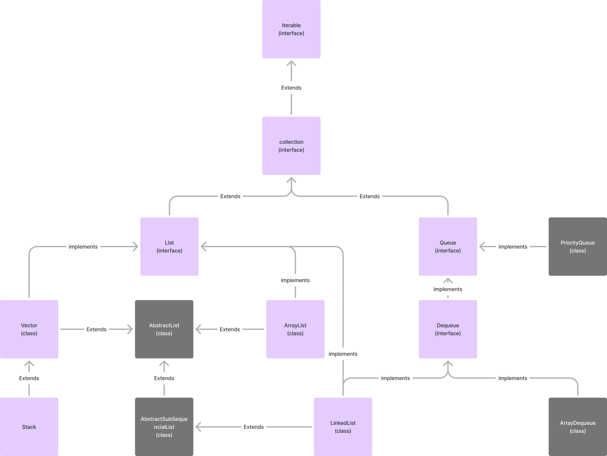

# My Java Collection Framework

This is a project where we are building the Java collection framework that demonstrates our understanding of OOP concept of java as well as the workings of Java collection framework.


## Installation

To run this project or to check how much we could replicate the java collection framework, you need to first install java in your local system.

## Overview



## Folder Structure

```plaintext
src/
├── main/
│   ├── java/
│   │   ├── com/
│   │   │   ├── yourcompany/
│   │   │   │   ├── collections/
│   │   │   │   │   ├── interfaces/
│   │   │   │   │   │   ├── Iterable.java
│   │   │   │   │   │   ├── Collection.java
│   │   │   │   │   │   ├── Queue.java
│   │   │   │   │   │   ├── Deque.java
│   │   │   │   │   │   └── List.java
│   │   │   │   │   ├── classes/
│   │   │   │   │   │   ├── Vector.java
│   │   │   │   │   │   ├── ArrayList.java
│   │   │   │   │   │   ├── Stack.java
│   │   │   │   │   │   └── LinkedList.java
│   │   │   │   │   ├── nodes/
│   │   │   │   │   │   └── Node.java
│   │   │   │   │   ├── utils/
│   │   │   │   │   │   └── Iterator.java
│   │   │   │   │   ├── factory/
│   │   │   │   │   │   └── CollectionFactory.java
│   │   │   │   │   └── decorators/
│   │   │   │   │       ├── SynchronizedCollection.java
│   │   │   │   │       └── SynchronizedList.java
│   ├── resources/
│   └── test/
│       ├── java/
│       └── resources
```

## Topics Demonstrated

- interable (interface)
- collection (interface)
- queue (interface)
- dqueue (interface)
- list (interface)
- vector (class)
- arrayList (class)
- stack (class)
- linkedList (class)

## 🔗 Links
[](https://www.linkedin.com/in/egypta-gogoi/)

## Authors

- [@egyptaGogoi](https://github.com/EgyptaGogoi/)

- [@nayanmoniBaruah](https://github.com/nayan458)
